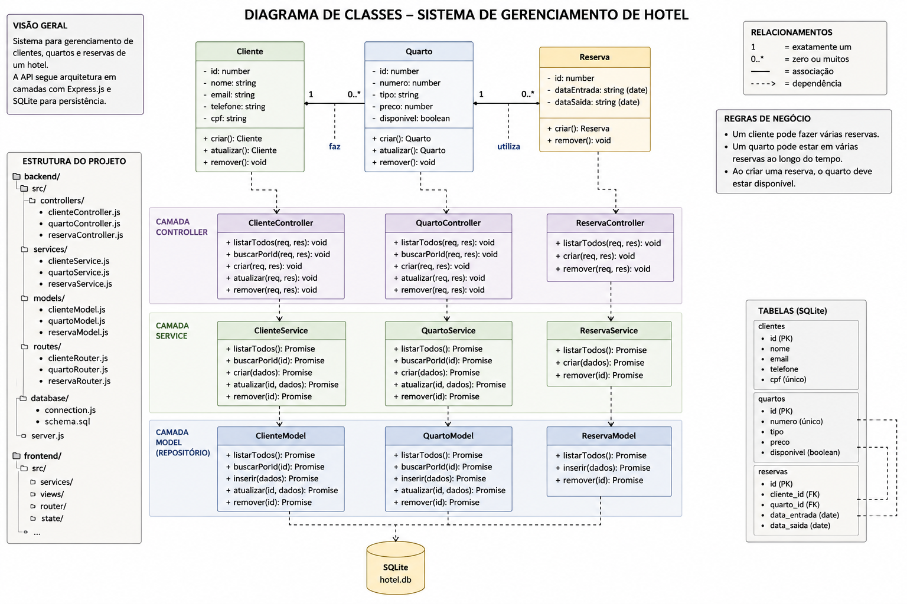

# 🏨 Hotel Costa

Sistema de Reservas de Hotel desenvolvido para a disciplina de **Programação Web**.

O projeto tem como objetivo aplicar conceitos de desenvolvimento web utilizando **Node.js**, **Express**, **JavaScript**, **Bootstrap**, **API REST** e **arquitetura em camadas**, evoluindo em etapas ao longo da disciplina.

---

# 📖 Sobre o Projeto

O Hotel Costa é um sistema de gerenciamento de reservas que permite:

* Cadastrar clientes;
* Gerenciar quartos;
* Realizar reservas;
* Consultar reservas cadastradas;
* Relacionar clientes e quartos através das reservas.

O projeto foi desenvolvido seguindo o padrão de arquitetura em camadas para separar responsabilidades e facilitar manutenção e evolução.

---

# 🚀 Tecnologias Utilizadas

## Backend

* Node.js
* Express.js
* SQLite3
* CORS
* JavaScript ES6 Modules

## Banco de Dados

* SQLite
* SQL Puro (DDL e DML)

## Frontend

* HTML5
* CSS3
* JavaScript
* Bootstrap 5
* Fetch API
* State Management

## Ferramentas

* Git
* GitHub
* VS Code
* Thunder Client

---

# 📊 Diagrama de Classes (UML)



## Relações

* Cliente (1:N) Reserva
* Quarto (1:N) Reserva

Uma reserva pertence a um único cliente e a um único quarto.

---

# 🏗️ Arquitetura do Projeto

### Backend

```text
Routes
   ↓
Controllers
   ↓
Services
   ↓
Models
   ↓
SQLite
```

### Frontend

```
UI
 ↓
State
 ↓
Services
 ↓
API (Fetch)
 ↓
Backend REST
```

```md
# 🗄️ Banco de Dados

O sistema utiliza SQLite para persistência dos dados.

### Entidades

#### Clientes

| Campo | Tipo |
|---------|---------|
| id | INTEGER |
| nome | TEXT |
| email | TEXT |
| telefone | TEXT |
| cpf | TEXT |

#### Quartos

| Campo | Tipo |
|---------|---------|
| id | INTEGER |
| numero | INTEGER |
| tipo | TEXT |
| preco | REAL |
| disponivel | INTEGER |

#### Reservas

| Campo | Tipo |
|---------|---------|
| id | INTEGER |
| cliente_id | INTEGER |
| quarto_id | INTEGER |
| data_entrada | TEXT |
| data_saida | TEXT |

### Relacionamentos

* Cliente (1:N) Reserva
* Quarto (1:N) Reserva

As relações são implementadas utilizando chaves estrangeiras no SQLite.

### Responsabilidades

#### Routes

Responsáveis pelo mapeamento das rotas da API.

#### Controllers

Recebem as requisições HTTP e retornam as respostas.

#### Services

Contêm as regras de negócio da aplicação.

#### Models

Representam as entidades e armazenam os dados da aplicação.

#### Middleware

Responsáveis por funcionalidades transversais como logs e tratamento de erros.

---

# 📂 Estrutura do Projeto

```text
HotelCosta/
│
├── backend/
│   │
│   ├── src/
│   │   ├── controllers/
│   │   ├── database/
│   │   │   ├── connection.js
│   │   │   └── schema.sql
│   │   │
│   │   ├── middleware/
│   │   ├── models/
│   │   ├── routes/
│   │   ├── services/
│   │   ├── app.js
│   │   └── server.js
│   │
│   ├── hotel.db
│   ├── package.json
│   └── .gitignore
│
├── frontend/
│   │
│   ├── css/
│   │   └── style.css
│   │
│   ├── js/
│   │   ├── services/
│   │   │   ├── clienteService.js
│   │   │   ├── quartoService.js
│   │   │   └── reservaService.js
│   │   │
│   │   ├── ui/
│   │   │   ├── clienteView.js
│   │   │   └── reservaView.js
│   │   │
│   │   ├── state/
│   │   │   └── store.js
│   │   │
│   │   ├── api.js
│   │   ├── config.js
│   │   └── main.js
│   │
│   └── index.html
│
├── docs/
│   └── uml-hotel-costa.png
│
└── README.md
```

---

# 🚀 Acesso Rápido

## Aplicação Online

🔗 Frontend:
https://beamish-cactus-4d031a.netlify.app/

🔗 API:
https://hotel-costa.onrender.com

---

## Executar Localmente

### Backend

cd backend

npm install

npm run dev

### Frontend

Abra o arquivo index.html ou utilize o Live Server.

---

# 📡 Endpoints da API

## Clientes

| Método | Endpoint      |
| ------ | ------------- |
| GET    | /clientes     |
| GET    | /clientes/:id |
| POST   | /clientes     |
| PUT    | /clientes/:id |
| DELETE | /clientes/:id |

---

## Quartos

| Método | Endpoint     |
| ------ | ------------ |
| GET    | /quartos     |
| GET    | /quartos/:id |
| POST   | /quartos     |
| PUT    | /quartos/:id |
| DELETE | /quartos/:id |

---

## Reservas

| Método | Endpoint      |
| ------ | ------------- |
| GET    | /reservas     |
| GET    | /reservas/:id |
| POST   | /reservas     |
| PUT    | /reservas/:id |
| DELETE | /reservas/:id |

---

# ✅ Funcionalidades Implementadas

## Clientes

* Cadastro de clientes
* Listagem de clientes
* Remoção de clientes

## Quartos

* Cadastro de quartos
* Listagem de quartos
* Consulta de disponibilidade

## Reservas

* Cadastro de reservas
* Listagem de reservas
* Remoção de reservas
* Associação entre clientes e quartos

## Frontend

* SPA (Single Page Application)
* Consumo de API REST com Fetch API
* Atualização dinâmica da interface
* Seleção automática de clientes
* Seleção automática de quartos
* Formatação de datas em padrão brasileiro

---

# 🎯 Objetivos Acadêmicos

* Aplicar conceitos de Programação Web.
* Desenvolver APIs REST utilizando Express.
* Implementar arquitetura em camadas.
* Trabalhar relacionamentos entre entidades.
* Consumir APIs utilizando Fetch API.
* Utilizar Git e GitHub para versionamento.
* Desenvolver uma aplicação SPA.

---

# 👨‍💻 Autor

**Taélis Holanda**

Estudante de Ciência da Computação — UEPB

GitHub: https://github.com/Taeliscosta
